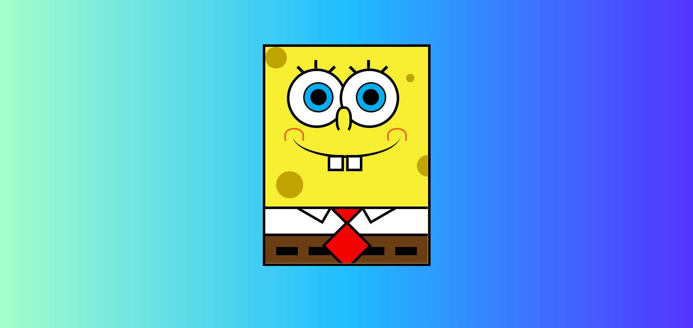

¡¡¡Él vive en la piña debajo del mar!!!

¡¡¡Boooooooob Esponjaaaaaaaaaaaaaa!!!

Podéis ver el resultado en este enlace: https://mogedano.github.io/bob-esponja/ . 

Dibujo de Bob Esponja realizado con HTML y CSS, con base en el tutorial de Carlos Arturo (http://www.falconmasters.com/web-design/tutorial-como-dibujar-bob-esponja-css3/) y que puede seguirse en este vídeo: https://www.youtube.com/watch?v=rS4a4Gya8f8&ab_channel=FalconMasters . 
